# Digital Vertical Jump Tester
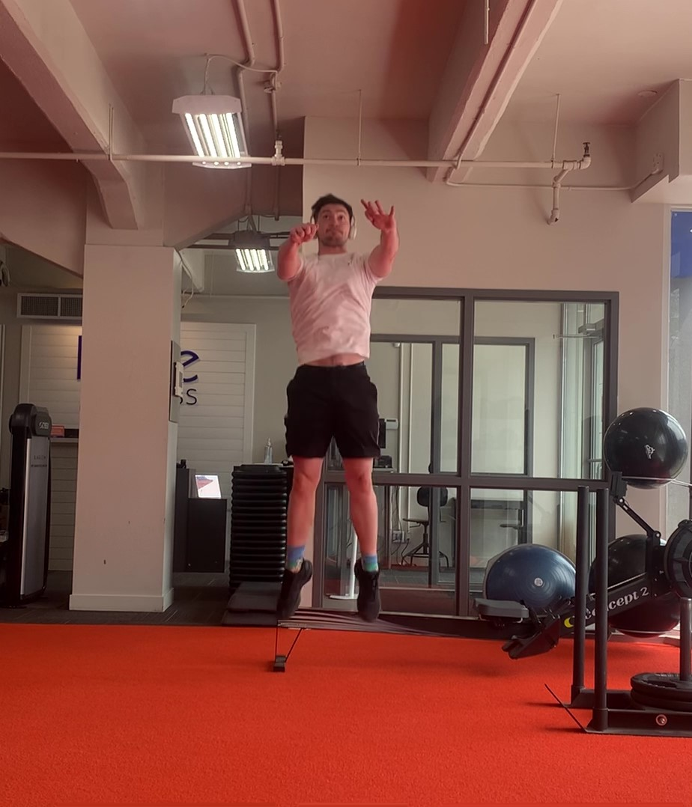

## Introduction

I've always found demonstrations to be the best way to introduce a project, they get right to the point. This project is a digital vertical jump tester, meant mainly as a performance measurement tool to help with explosivity tracking. As a coach, and low-tier athlete, measurements are essential to progress, and vertical jump measurement solutions tend to be inconsistent or just straight up expensive. I figured I was smart enough now to actually solve my own niche problems with my new fancy degree, so I built a video processor using Python, OpenCV and MediaPipe, that will measure a wide variety of jumping videos.

Here is a gif of me dunking

> The Pinnacle of Athleticism I
>
> 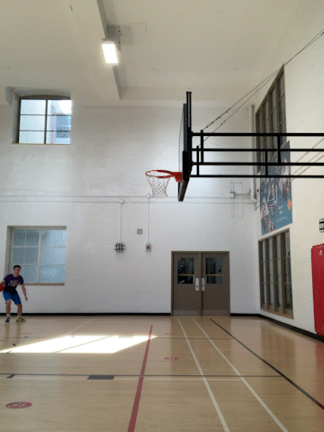

And another one

> The Pinnacle of Athleticism II
>
> 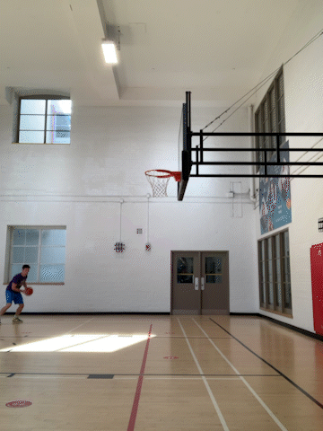

Using those videos as examples, the project produced jump values of 33.97 inches and 35.67 inches respectively, it also produced these demonstration videos to show exactly how the measurement was obtained. This is a built in piece of the software.

> Tracking Vertical Jump via Shoulder Levels I
>
> 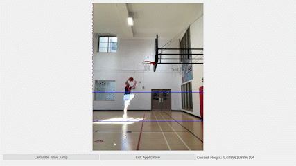
>
> 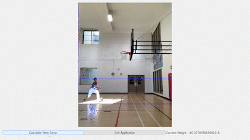

As a functional addition, I also attempted to measure the different components of the jump. Specifically I wanted to look at descent speed (an my ability to drop the shoulders and hips before launching), the ground contact time (to see how quickly I'm accelerating upwards from my descent), and the descent level (to see how low I get on each jump). In a running video like this, these statistics tend to be less useful, however in stationary tests they can be great metrics for gauging how different approaches to explosivity training are contributing to the someone's vertical jump. The measured values are loosely marked on the shoulder level plots (displayed below) that the program generates for the user.

> Shoulder Path Plots
>
> 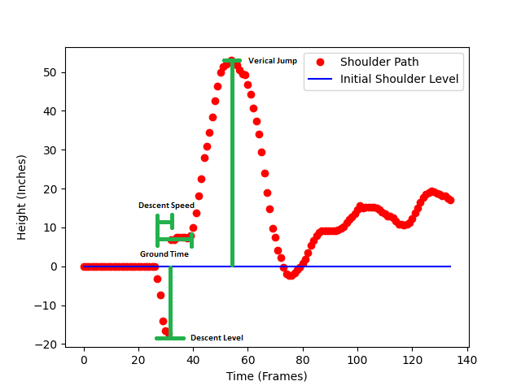
>
> 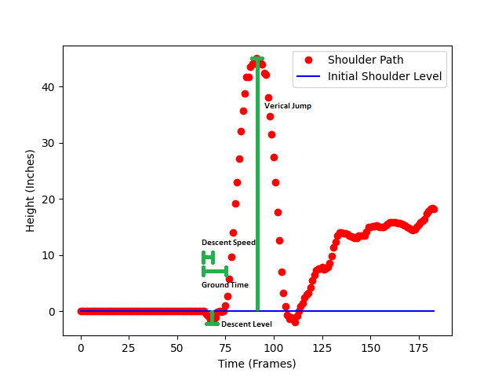

That's a brief rundown on some of the coolest stuff the program can do. Below I'll be going over all of the intricacies of the program, and how it can best be used within a training program.

## Program Rundown Contents
[Project Setup](https://github.com/ben-morehead/BasketballPlayTracking/blob/main/README.md#project-setup)

[UI Walkthrough](https://github.com/ben-morehead/BasketballPlayTracking/blob/main/README.md#ui-walkthrough)

[Code General Overview](https://github.com/ben-morehead/BasketballPlayTracking/blob/main/README.md#code-general-overview)

[Effective Usage](https://github.com/ben-morehead/BasketballPlayTracking/blob/main/README.md#effective-usage)

[Limitations](https://github.com/ben-morehead/BasketballPlayTracking/blob/main/README.md#limitations)

[Major Takeaways](https://github.com/ben-morehead/BasketballPlayTracking/blob/main/README.md#major-takeaways)

## Project Setup
#### Github Download

Pretty self explanatory, clone the repo and proceed to install the needed modules from the requirements.txt

#### Named Folders

This project exports the shoulder levels to a plot and a csv with the metrics to a folder called info_exports. For the program to function without error make sure you have a folder with that name in the working directory. Use run.py to start up the full program.

## UI Walkthrough

Quick Note: Throughout the usage of the program, it can be exited using on of the button prompts or pressing the ESCAPE button.

#### Introduction Page

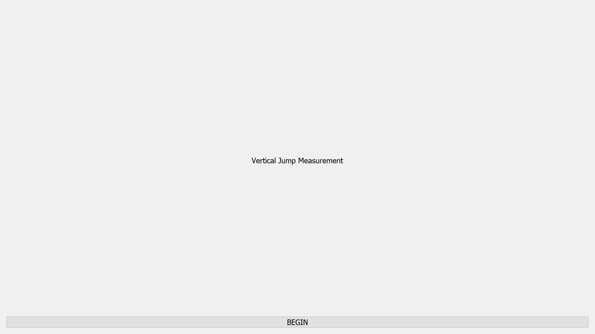

This page has no real purpose, I just like landing pages. It was an experiment used for setting up the QtPy structure, and is never seen again after pressing the BEGIN button.

#### Calibration Page

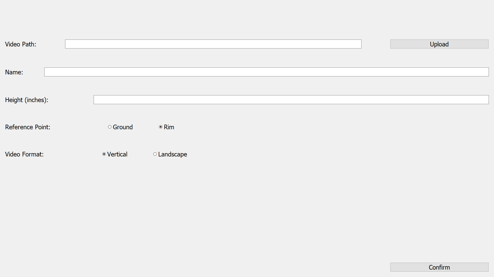

The calibration page sets up all of the needed inputs for the measuring of a vertical jump. It is displayed above and has the following input fields:

**Video Path**
Pressing the upload button will open a File Dialogue popup which allows you to select a jumping video to work with.

**Name**
Name of the jump, used for output file naming.

**Height**
Either the height of the rim or the height of the jumper depending on your reference point (rim or ground respectively). 

**Reference Point**
Calculations for scaling are done in different ways depending on whether using the ground as a reference point or the rim. There are different reference point calibrations depending on this selection.

**Video Format**
Determines display dimensions for scale calibration as well as demonstration outputs.

#### Configuration Page - Ground Reference Point
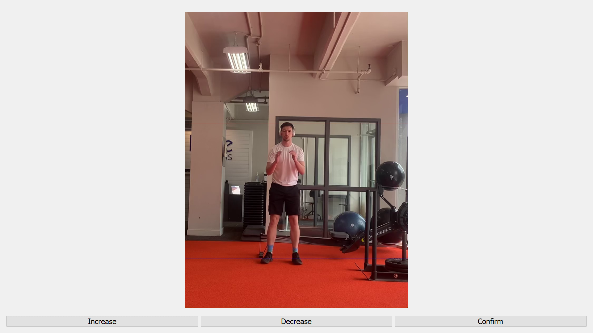

The configuration page prepares the scale for the video processing. Using the height given in the previous section and user input the program will create a scale to determine the jumper's joint locations. The ground reference point version of the program take the initial ankle location and estimates the height of the jumper, using the buttons in the ui this estimate can be adjusted to ensure accuracy.

#### Configuration Page - Rim Reference Point
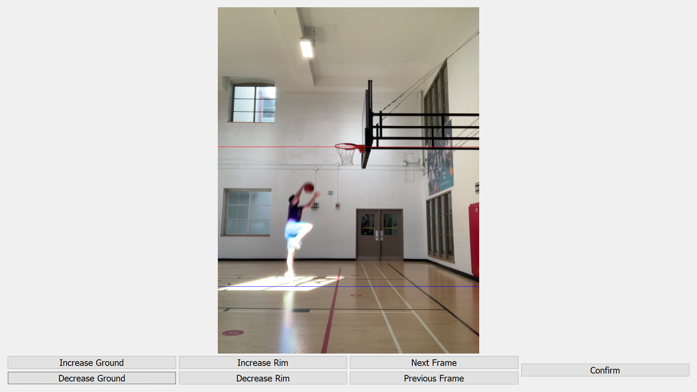

This configuration page isn't much different from using the ground reference option. This mode uses the rim height as it's reference and the user can adjust where the ground and rim are to best fit the video. An additional piece to this mode is the requirement of a launch frame, the program will estimate where launch happens but due to the moving nature of a rim jump (such as a dunk) there can be errors. Using the provided buttons, the user can adjust what is the launching frame of the jump.

#### Result's Page
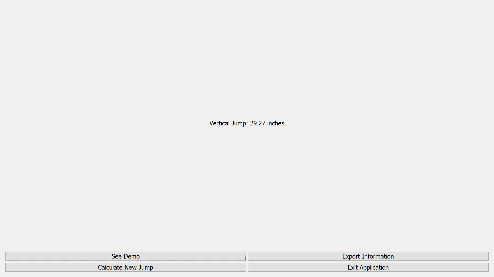

After confirming the scale of the video, the program handles all the math and provides a results page which shows the measured vertical jump. On this page as well you can exit the application, start a new measurement, export the jump-specific data or watch a demonstration of the program's calculations.

#### Export Information
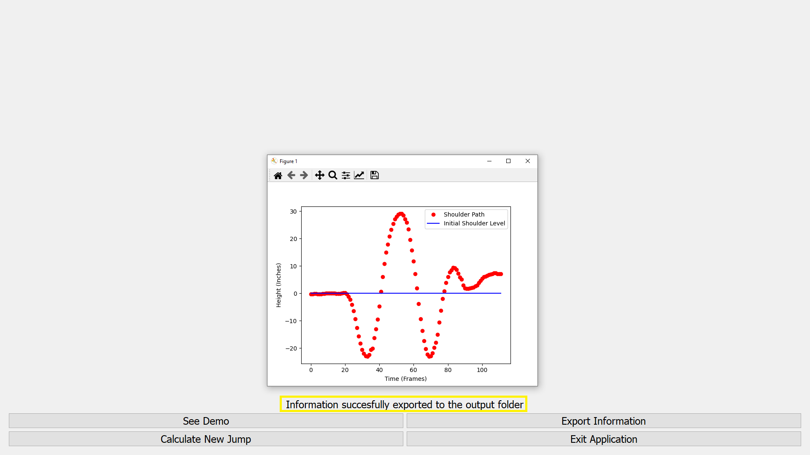

The program exports the data from the jump into two files, one being a png that shows the shoulder levels of the jump, and a csv that holds the measured values from the jump (vertical jump, shoulder descent speed, ground time and the lowest shoulder level). The shoulder level graph is showed to the user once the "Export Information" button is pressed, as well as a status indicator to update the user. The information is hardcoded to be exported into a folder named info_exports, so if the user wishes to cleanly export the information that folder needs to exist in the base project directory.

#### Demonstration
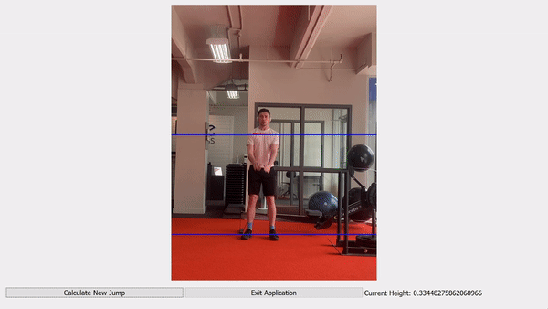

The demonstration of the jump shows how the jump height is calculated. It displays the base shoulder height as well as a current shoulder height for each frame of the video. In the bottom right of the interface is the measured shoulder height which illustrates the change of measured shoulder height throughout the processing of the video.

## Code General Overview

The upcoming section will give a brief overview of the program logic and code structure without going too in depth. This serves essentially as a jumping off point for those exploring the program and can help with debugging personal spinoff projects. Proper code documentation will be continually updated in-line with the source code and will hopefully answer more detailed and specific questions.

#### run.py

**run.py** prepares the QTPy application window and launches the program.

#### mapping.py

**mapping.py** holds a dictionary containing the joint mappings for the mediapipe video processing.

#### handlers.py

**handlers.py** holds class definitions for the CalibrationHandler class and the PoseHandler class. The PoseHandler class is imported almost verbatim from the mediapipe library and allows for frame-by-frame processing of the video in the interest of finding the joints of interest for the jump.

The CalibrationHandler is written customly to calculate all the information surrounding the jump. It takes the data from the calibration and configuration pages and combines uses the mediapipe pose recognition to calculate the jump information at its respective scale. This is the meat of the program and covers most of the program logic from data acquisition from the UI to pre-processing of the source video to ensure a fully responsive user experience.

#### ui.py

**ui.py** defines the UI components of the program and directs the general flow of data. It holds the definition for the Window class that **run.py** instantiates, which is the bread and butter of the interactive UI. Within the window class are several types of class methods, mainly definitions for each of the UI's pages. These definitions hold all of the input and output objects that would be interacted with by the user. In conjunction with the page definitions are helper functions and handlers that do all of the cross-level processing and allows for interaction with the CalibrationHandler.

## Effective Usage

This program specifically is meant to be used as a consistent measuring tool within an athlete's training and programming. The more consistent the environment of the jumps, the more accurate the improvements seen will be. When I use this as a coach for my basketball team, I will ensure that the filming takes place at the exact same spot each month, that the athletes perform the same type of jump each time (at the moment a standing two foot jump is the focus), and that we measure each athlete at the time of the jump video. 

The tool can still be used to settle curiosity and see how high an individual jumped in a sample video, but given the manual nature of the scaling calculations there is a higher margin of error attached with that. As you take more measurements over time in the same environment you can properly see how a given training regiment is helping (or hurting) your improvements and can make adjustments from there.

## Limitations

As with most homemade projects, the program is fairly error prone. There are several safeguards put throughout to limit these accuracy issues, but improper use of the program will resurface them. The more movement involved in the source video, the more likely that the program will be unable to detect the human body properly and the more likely for the scale to be incorrect. That being said, after testing with the rep team I coach in a standardized environment we were able to see consistent results and improvements over time, meaning that with focus and precision in the setup, the results can achieve high levels of accuracy and thus usefulness.

## Major Takeaways

I initially started this project hoping to make my own physical rendition of the Vertec vertical jump tester. I purchased the PVC pipes and everything, and once I used my brain a little bit, noticed that I had all the necessary skills and resources needed to create a digital version. I saw it as an opportunity to use Machine Learning and Computer Vision as a way to benefit my everyday life that currently revolves almost entirely around basketball and athletic training. Even currently, I am adapting the program to provide information for training specificity in my current vertical training program (i.e. loading squats within my jumping range and using the program to calculate those appropriate joint angles). As a computer engineer invested in the world of basketball, this was an extraordinarily fulfilling project and although there are little knicks and bugs that can always be fixed and improved upon, it is by far the most proud I have been for any of my personal projects.
