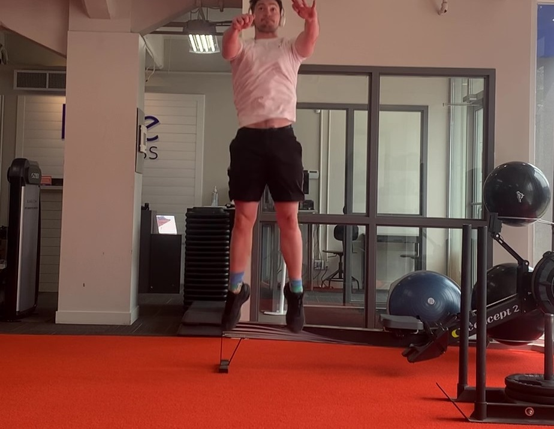

# Digital Vertical Jump Tester

## Introduction

I've always found demonstrations to be the best way to introduce any project, it gets right to the point. This project is a digital vertical jump tester, meant mainly as a performance measurement tool to help with explosivity tracking. As a coach, and low-tier athlete, measurements are essential to progress, and vertical jump measurement solutions tend to be inconsistent or just straight up expensive. I figured I was smart enough now to actually solve my own niche problems with my new fancy degree, so I built a video processor that will measure multiple different types of jumping videos.

Here is a gif of me dunking

> The Pinnacle of Athleticism I
>
> 

And another one

> The Pinnacle of Athleticism II
>
> 

When sending that video through my project it told me I jumped ___ and ___ respectively, and gave me these demonstration videos to show exactly how the measurement was obtained. This is a built in piece of the software.

## Contents
[General Overview](https://github.com/ben-morehead/BasketballPlayTracking/blob/main/README.md#general-overview)

[Court Detecting Autoencoder](https://github.com/ben-morehead/BasketballPlayTracking/blob/main/README.md#court-detecting-autoencoder)

[Center of Play Detection](https://github.com/ben-morehead/BasketballPlayTracking/blob/main/README.md#center-of-play-detection)

[Live Tracking the Play](https://github.com/ben-morehead/BasketballPlayTracking/blob/main/README.md#live-tracking-the-play)

[Next Steps](https://github.com/ben-morehead/BasketballPlayTracking/blob/main/README.md#next-steps)

[Potential Improvements](https://github.com/ben-morehead/BasketballPlayTracking/blob/main/README.md#potential-improvements)

[Project Installation](https://github.com/ben-morehead/BasketballPlayTracking/blob/main/README.md#project-installation)
